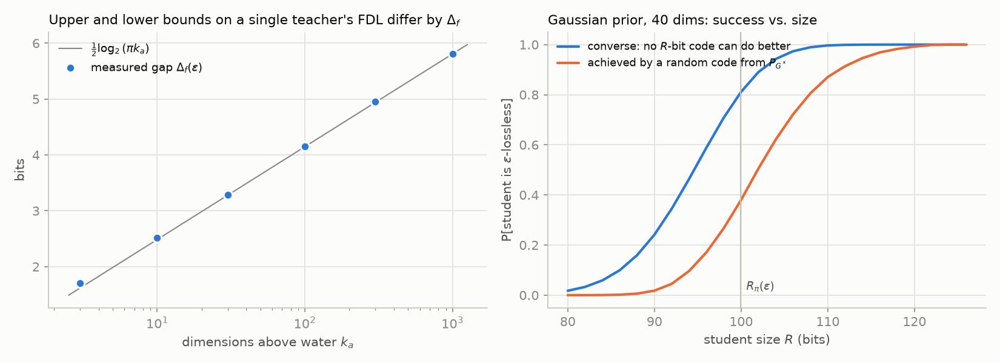
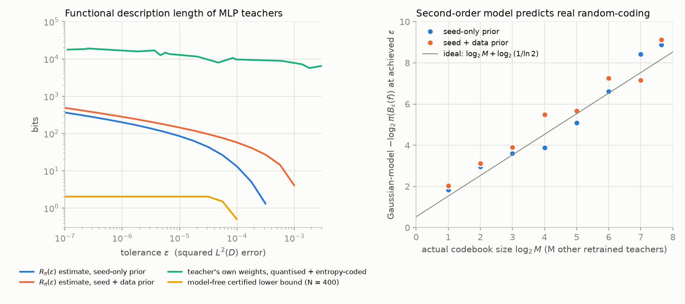
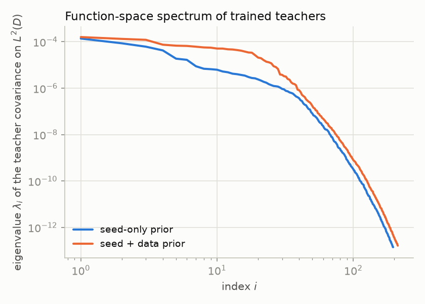

# The functional information of trained teachers

**Open problem.** Characterise, or give computable bounds on, $I_\infty(\pi,D)$ from Theorem 3.1 for realistic priors, such as the distribution of networks produced by a training procedure. Is there a data-dependent estimator of the functional description length (FDL) of a single trained teacher, such as the minimal $R$ at which some $R$-bit student is $\varepsilon$-lossless, with matching upper and lower bounds?

> **Reconstruction note.** The paper that contains Theorem 3.1 is not in this repository and I could not find it online. I read $I_\infty(\pi,D)$ as the **functional information**: what infinitely many queries of a teacher $F\sim\pi$ on inputs $X\sim D$ reveal about $F$ (Definition 1.2). I read Theorem 3.1 as saying that this quantity is the threshold for lossless distillation into $R$-bit students. Every result below is stated in terms of objects defined here from scratch: the rate–distortion function $R_\pi(\varepsilon)$ and the tilted information $\jmath_\pi(f,\varepsilon)$. None of them depends on the exact wording of Theorem 3.1. If Theorem 3.1 uses an order-$\infty$ (min- or max-entropy) version instead, the relevant statement is Corollary 4.3 (quantiles of $\jmath_\pi$).

Code and data for every number quoted below are in [`code/`](../code) and [`results/`](../results). Section 6 lists the commands.

---

## 0. Summary

1. **What $I_\infty$ is.** $I_\infty(\pi,D)=H([F]_D)$ is the entropy of the teacher's function modulo $D$-almost-everywhere equality, and $I_\infty=\lim_{\varepsilon\downarrow 0}R_\pi(\varepsilon)$ (Props. 2.1 and 2.2). For realistic priors this gives three regimes (Cor. 2.3):
   * **Unshared continuous randomness** (unknown data, hardware non-determinism, or the continuous idealisation of seeds): $I_\infty=\infty$. Exact lossless distillation into finitely many bits is impossible.
   * **Finite-precision tanh teachers:** $I_\infty = H(\theta)-\mathbb E\log_2|\mathcal G\theta|$, the checkpoint entropy minus the log-size of its permutation and sign-flip orbit. An exactly lossless student therefore needs essentially the whole checkpoint.
   * **Bit-reproducible training with the recipe and data known to the decoder:** $I_\infty\le H(\text{seed})$, for example 64 bits. Lossless distillation is then information-theoretically trivial ("retrain with seed $s$"), and the obstruction is purely computational.

   So $I_\infty$ is infinite, dominated by the number format, or dominated by the seed. The informative quantity is its $\varepsilon$-regularisation $R_\pi(\varepsilon)$.

2. **Computable two-sided bounds for training-procedure priors** (Section 3). Write $\lambda_1\ge\lambda_2\ge\dots$ for the eigenvalues of the teacher covariance operator on $L^2(D)$, which can be estimated by retraining. Then

   $$\max\Big\{R_{F\mid S}(\varepsilon),\ \tfrac12\sum_{i\le k}\log_2\tfrac{k\lambda_i}{\varepsilon}-D(\pi_k\Vert\mathcal N_k)\Big\}\ \le\ R_\pi(\varepsilon)\ \le\ \min\Big\{R_C(\varepsilon),\ R_{F\mid S}(\varepsilon)+I(F;S)\Big\},$$

   where $R_C$ is Kolmogorov's reverse water-filling formula. The slope of $R_\pi$ is the *scale-dependent functional dimension* $d_\pi(\varepsilon)=2\varepsilon\lambda^{\ast}(\varepsilon)$, with

   $$R_\pi(\varepsilon)=\tfrac12\int_\varepsilon^{\varepsilon_{\max}}d_\pi(s)\,\tfrac{ds}{s}\quad\text{(nats)}.$$

   As $\varepsilon\to 0$, $d_\pi(\varepsilon)$ tends to the information dimension of the prior (at most the rank of the functional Jacobian). For lazy (NTK-regime) training the prior is a Gaussian process and $R_\pi=R_C$ holds exactly.

3. **A single teacher's FDL exists and is determined to within $O(\log k)$ bits** (Thm. 4.1). The $\varepsilon$-tilted functional information $\jmath_\pi(f,\varepsilon)$ satisfies two bounds:
   * **Lower bound.** For every student language fixed before the teacher is drawn, $\Pr_{F\sim\pi}\big[L_\varepsilon(F)\le \jmath_\pi(F,\varepsilon)-\gamma\big]\le 2^{-\gamma}$.
   * **Upper bound.** A prior-matched language achieves $L_\varepsilon(f)\le\jmath_\pi(f,\varepsilon)+\Delta_f(\varepsilon)+\log_2\ln\frac1\delta+O(\log)$ for **every** $f$, where $\Delta_f(\varepsilon)\approx\frac12\log_2 k_a+0.83$.

   Also $\mathbb E\,\jmath_\pi=R_\pi(\varepsilon)$, and $\operatorname{Var}\jmath_\pi=V_\pi(\varepsilon)$ is the rate-dispersion. For Gaussian priors, $\jmath$ and $\Delta_f$ have closed forms (Cor. 4.2).

4. **What cannot be done** (Section 5). For universal student languages the FDL is uncomputable, and no sound computable lower bound can exceed a constant (Thm. 5.1). From $N$ black-box samples of the prior, no procedure can certify more than $2\log_2N+\log_2\frac1\delta$ bits of $R_\pi(\varepsilon)$, $I_\infty$, or a teacher's ball self-information (Thm. 5.2). **Matching data-dependent bounds therefore exist only relative to a prior and only under a structural model, such as a second-order (Gaussian) model. The model-dependence of the lower bound cannot be removed.**

5. **Estimator and evidence** (Section 6). The estimator is cross-fitted and second-order: retrain $N$ teachers, estimate the $L^2(D)$ eigenbasis on one half and the variances on the other half, then plug into the closed forms. On tanh-MLP teachers with 1185 parameters it gives the following:
   * $R_\pi(\varepsilon)$ ranges from 13 bits at $\varepsilon=10^{-4}$ to 366 bits at $\varepsilon=10^{-7}$ for the seed-only prior, and from 58 to 487 bits for the seed+data prior.
   * It predicts the performance of a real codebook of retrained teachers to within about 1 bit.
   * It ranks individual teachers by how hard they are to code (correlation 0.8).
   * For comparison, the model-free certified lower bound is about 2 bits, as Thm. 5.2 predicts, and a direct weight-quantised student needs 8–20 thousand bits.

---

## 1. Setting

* $(\mathcal X,D)$ is a standard Borel probability space (the inputs). $\mathcal Y$ is a Polish output space: logits $\mathbb R^K$, the simplex $\Delta_K$, or labels.
* The per-input loss $\ell:\mathcal Y\times\mathcal Y\to[0,\infty]$ satisfies $\ell(y,y)=0$ and $\ell(y,y')\ge\psi(\rho(y,y'))$, for a metric $\rho$ and an increasing $\psi$ with $\psi(t)>0$ for $t>0$. Examples: squared error, KL (via Pinsker), 0–1 disagreement.
* The **functional distortion** is $d_D(f,g)=\mathbb E_{X\sim D}\,\ell(f(X),g(X))$. Write $[f]_D$ for the class of $f$ modulo $D$-a.e. equality; it is an element of the Polish space $\mathbb L=L^0(D;\mathcal Y)$.
* The **teacher prior** $\pi$ is a distribution over functions, with $(f,x)\mapsto f(x)$ jointly measurable. Typically $\pi$ is the law of $f_\theta$ with $\theta=\mathsf A(S,\xi)$ for an algorithm $\mathsf A$, training sample $S\sim D^n$ (with labels), and randomness $\xi$ (initialisation, data order, dropout, hardware non-determinism).
* A **student language** is a decoder $\mathrm{Dec}$ from a prefix-free set $\mathcal P\subset\{0,1\}^{\ast}$ (so $\sum_p2^{-|p|}\le1$) to functions. The fixed-length version uses $\mathcal P=\{0,1\}^R$. "Direct" students (weights stored in $R$ bits) and "indirect" ones (e.g. "retrain with seed $s$") are both covered.

**Definition 1.1 (functional description length).** $L^{\mathrm{Dec}}_\varepsilon(f)=\min\{|p|:\ d_D(f,\mathrm{Dec}(p))\le\varepsilon\}$. This is the minimal $R$ at which an $R$-bit student of the language is $\varepsilon$-lossless for $f$.

**Definition 1.2 (functional information).** $I_\infty(\pi,D)=\lim_{n\to\infty}I\big(F;\,X_{1:n},F(X_{1:n})\big)$, where $F\sim\pi$ and $X_i\overset{\text{iid}}{\sim}D$ independent of $F$. The sequence is non-decreasing in $n$.

**Definition 1.3.** $R_\pi(\varepsilon)=\inf\{I(F;G):\mathbb E\,d_D(F,G)\le\varepsilon\}$, with the infimum over kernels from teachers to arbitrary functions. The conditional version $R_{F\mid U}(\varepsilon)=\inf I(F;G\mid U)$ has the side information $U$ available to both encoder and decoder. Ball notation: $B_\varepsilon(f)=\{g:d_D(f,g)\le\varepsilon\}$, and the **ball self-information** is $\iota_\pi(f,\varepsilon)=-\log_2\pi(B_\varepsilon(f))$.

$\log$ is base 2 and $\ln$ is natural. For squared $L^2(D)$ distortion, $\lambda_i$ and $\varphi_i$ are the eigenpairs of the covariance operator $C$ of $F$ on $L^2(D)$. A teacher's coordinates are $z_i=\langle f-m,\varphi_i\rangle_{L^2(D)}$ with $m=\mathbb E F$.

---

## 2. What $I_\infty(\pi,D)$ is

**Proposition 2.1.** $I_\infty(\pi,D)=I(F;[F]_D)=H([F]_D)=\mathbb E\big[-\log_2\pi([F]_D)\big]$. The convention is $H=\infty$ if the law of $[F]_D$ is not purely atomic.

**Proposition 2.2.** $R_\pi(\varepsilon)\uparrow I_\infty(\pi,D)$ as $\varepsilon\downarrow 0$.

Proofs are in Appendix A.1–A.2. The ingredients are martingale continuity of mutual information, the strong law of large numbers identifying $[F]_D$ from infinitely many queries, and lower semicontinuity of mutual information.

**Corollary 2.3 (three regimes for training-procedure priors).** Let $F=f_{\mathsf A(S,\xi)}$.

* **(a) Unshared continuous randomness.** Suppose the law of $[F]_D$ has a non-atomic part. This happens, for example, if $\theta$ has a density and $\theta\mapsto[f_\theta]_D$ has Lebesgue-null level sets, which holds whenever the functional Jacobian is non-zero almost everywhere. Then $I_\infty=\infty$, and no finite $R$ gives exact lossless distillation.
* **(b) Finite precision and symmetry.** Suppose $\theta$ ranges over a finite grid (bf16, fp32) and $\pi_\theta$ is invariant under a finite group $\mathcal G$ with $f_{g\theta}=f_\theta$ (hidden-unit permutations, and sign flips for odd activations). Then
  $$I_\infty(\pi,D)\ \le\ H(\theta)-\mathbb E\log_2|\mathcal G\theta|,$$
  with equality iff $[f_\theta]_D$ determines $\theta$ up to $\mathcal G$ on the support of $\pi$. For tanh MLPs with generic ("irreducible") weights this identifiability holds whenever $\operatorname{supp}D$ has non-empty interior, by Sussmann (1992) and Fefferman (1994), because analyticity extends $D$-a.e. equality to all of $\mathbb R^d$. When the action is free, $\log_2|\mathcal G|=\sum_l(\log_2 n_l!+n_l)$ for hidden widths $n_l$.
* **(c) Shared recipe and data, bit-reproducible training.** If the decoder knows $\mathsf A$ and $S$ and $\xi$ is a $b$-bit seed, then $R_\pi(\varepsilon)\le I_\infty\le H(\xi)\le b$ for every $\varepsilon$.

*Example.* The MLP teachers of Section 6 (2-32-32-1, tanh, $P=1185$) have $\log_2|\mathcal G|=2(\log_2 32!+32)\approx 299$ bits. Stored in bf16, suppose unshared randomness makes the low-order weight bits nearly uniform, so $H(\theta)$ approaches $16P\approx 19{,}000$ bits. Then an exactly lossless student must spend about $19{,}000-299$ bits. In contrast, a tolerance of $\varepsilon=10^{-7}$ in squared $L^2(D)$ costs only about 366 bits relative to the prior (Section 6).

**Remark 2.4 (what the prior must mean).** Regime (c) shows that $I_\infty$ measures uncertainty *relative to what the student's decoder shares with the teacher's producer*. For Theorem 3.1 to express a real obstruction, $\pi$ must be the law of the teacher given everything the decoder knows. For example, if the distiller knows the recipe and $D$ but not the training sample, the seed, or the hardware noise, then $\pi$ is the law of $f_{\mathsf A(S,\xi,\nu)}$ over all three. Summers & Dinneen (2021) observe that flipping a single bit of the initialisation produces as much functional variability as changing the seed. The training map is therefore effectively chaotic. Any unshared randomness, however small, is amplified to the full seed-to-seed functional spread, so below the seed-to-seed scale the prior behaves as in regime (a).

**Conclusion of Section 2.** For every realistic prior, $I_\infty$ is either infinite, or equal to "(entropy of the checkpoint given what the decoder knows) minus (exact symmetries)". This is the precise sense in which *exact* lossless distillation is impossible. The meaningful object is $R_\pi(\varepsilon)$ together with its single-teacher version $\jmath_\pi(f,\varepsilon)$.

---

## 3. The $\varepsilon$-version: computable bounds for training-procedure priors

### 3.1 Scale-dependent functional dimension

$R_\pi$ is convex and non-increasing, with slope $-\lambda^{\ast}(\varepsilon)$ in nats per unit of distortion. Define $d_\pi(\varepsilon)=2\varepsilon\lambda^{\ast}(\varepsilon)$ and $\varepsilon_{\max}=\inf_g\mathbb E\,d_D(F,g)$. Then

$$R_\pi(\varepsilon)=\tfrac12\int_\varepsilon^{\varepsilon_{\max}}d_\pi(s)\,\frac{ds}{s}\ \ \text{nats}.$$

For squared $L^2(D)$ distortion, $\varepsilon_{\max}=\operatorname{tr}C=\tfrac12\mathbb E\lVert F-F'\rVert^2$ is half the mean squared distance between two independently trained teachers. At tolerances above this *seed-to-seed scale*, a prior-aware student needs 0 bits on average over teachers: it outputs the ensemble mean.

**Proposition 3.1 (dimension).**
1. For a Gaussian prior, $d_\pi(\varepsilon)=k_a(\varepsilon)+\sum_{\lambda_i\le\theta}\lambda_i/\theta$. Here $\theta=\theta(\varepsilon)$ is the water level, $\sum_i\min(\lambda_i,\theta)=\varepsilon$, and $k_a=\#\{i:\lambda_i>\theta\}$ counts the eigenvalues "above water".
2. Suppose $\pi$ lives on a flat $k$-dimensional family (e.g. a linearised network $f_\theta=\sum_j\theta_j\phi_j$ with Gram matrix of rank $k$), its coordinates $Z$ have finite differential entropy, and a mild moment condition holds. Then $R_\pi(\varepsilon)=h(Z)-\frac k2\log\frac{2\pi e\,\varepsilon}{k}+o(1)$ (asymptotic tightness of the Shannon lower bound, Linder & Zamir 1994), so $d_\pi(\varepsilon)\to k$.
3. In general, on finitely many query points, $\lim_{\varepsilon\to 0}R_\pi(\varepsilon)/(\frac12\log\frac1\varepsilon)$ equals the Rényi information dimension of $\pi$ whenever the latter exists (Kawabata & Dembo 1994). It is bounded by the generic rank of the Jacobian of $\theta\mapsto(f_\theta(x))_{x\in\operatorname{supp}D}$, the *functional dimension* (Grigsby et al. 2022). For ReLU networks this rank is at most $P-\#\text{hidden units}$.

*Remark (order of contact).* Squared-type losses (MSE, KL) vanish quadratically in a parameter perturbation, so $R\approx\frac k2\log\frac1\varepsilon$. Top-1 disagreement vanishes linearly, because the disagreement region is a sliver of width $\propto\lVert\delta\rVert$ around the decision boundary, so $R\approx k\log\frac1\varepsilon$. The losslessness criterion therefore sets the prefactor.

### 3.2 Upper bounds

**Theorem 3.2 (second-moment bound; Kolmogorov 1956).** Take squared $L^2(D;\mathbb R^K)$ distortion and $\mathbb E\lVert F\rVert^2<\infty$. Then

$$R_\pi(\varepsilon)\ \le\ R_C(\varepsilon):=\sum_i\tfrac12\log^+\frac{\lambda_i}{\theta},\qquad \sum_i\min(\lambda_i,\theta)=\varepsilon,$$

with equality iff $\pi$ is Gaussian (for $\varepsilon<\operatorname{tr}C$). More generally, let $(\psi_i)$ be *any* fixed orthonormal system, $c$ any centre, $\sigma_i^2=\mathbb E\langle F-c,\psi_i\rangle^2$ the second moments, and $e_{\rm res}$ the energy outside the span. Then $R_\pi(\varepsilon)\le R_{\mathrm{diag}}(\varepsilon-e_{\rm res};\sigma^2)$, the water-filling formula applied to the $\sigma_i^2$. This bound is valid for every $\pi$ and is what the estimator in Section 6 evaluates. The proof is to code each coordinate independently with a Gaussian test channel: MSE depends only on second moments, and $I(Z;\hat Z)\le\sum_i I(Z_i;\hat Z_i)$ for coordinate-wise channels.

*KL distillation.* With centred logits $u$, $\mathrm{KL}(\mathrm{softmax}\,u\Vert\mathrm{softmax}\,v)\le\frac14\lVert u-v\rVert^2$, because the Hessian of log-sum-exp has operator norm at most $\tfrac12$. By Pinsker, $\mathrm{KL}(p\Vert q)\ge\frac12\lVert p-q\rVert_2^2$. Hence

$$R^{\mathrm{prob}\text{-}L^2}_\pi(2\varepsilon)\ \le\ R^{\mathrm{KL}}_\pi(\varepsilon)\ \le\ R^{\mathrm{logit}\text{-}L^2}_\pi(4\varepsilon)\ \le\ R_{C_{\rm logit}}(4\varepsilon).$$

Locally, KL is $\frac12\lVert u-v\rVert^2_{\Phi(x)}$ with the softmax Fisher metric $\Phi=\operatorname{diag}p-pp^\top$, so the Gaussian analysis applies with the Fisher-weighted $L^2(D)$ inner product.

*Parametric covering bound.* If $\operatorname{supp}\pi\subset\{f_\theta:\lVert\theta\rVert\le B\}$ and $\theta\mapsto f_\theta$ is $L$-Lipschitz into $L^2(D)$, then $R_\pi(\varepsilon)\le P\log_2(1+2BL/\sqrt\varepsilon)$. This is the classical "count the parameters" bound. It is loose exactly when the functional dimension is much smaller than $P$.

**Theorem 3.3 (seed/data sandwich).** Let $F=f_{\mathsf A(S,\xi)}$ with $S\perp\xi$.
1. $R_{F\mid S}(\varepsilon)\le R_\pi(\varepsilon)\le R_{F\mid S}(\varepsilon)+I(F;S)$.
2. **Branching monotonicity.** Write $\xi=(\xi_1,\dots,\xi_T)$ for the randomness injected in successive training phases (initialisation, then each epoch's data order). Then $t\mapsto R_{F\mid S,\xi_{\le t}}(\varepsilon)$ is non-increasing. "Late-branch" variability therefore gives lower bounds. It can be measured by restarting training from a checkpoint with fresh randomness, as in Frankle et al. (2020).
3. **Noisy training.** Consider $\theta_t=\theta_{t-1}-\eta_t g_t+\sigma_t\zeta_t$ with $\lVert g_t\rVert\le L$ and $\zeta_t\sim\mathcal N(0,I_P)$, as in SGLD. Then $I(F;S)\le I(\theta_T;S)\le\sum_t\frac P2\log(1+\frac{\eta_t^2L^2}{P\sigma_t^2})$ (Pensia, Jog & Loh 2018). The gap between the two sides of item 1 is thus bounded by a quantity from information-theoretic generalisation theory: teachers that memorise little about their sample are cheap to describe given only the recipe and $D$.

The proof is in Appendix A.3: conditioning reduces the rate–distortion function, and $I(F;G)\le I(F;S)+I(F;G\mid S)$.

### 3.3 Lower bounds

**Theorem 3.4.** Take squared $L^2(D)$ distortion.
1. **Projected Shannon lower bound.** For every $k$,
   $$R_\pi(\varepsilon)\ \ge\ \tfrac12\sum_{i\le k}\log\frac{k\lambda_i}{\varepsilon}\ -\ D(\pi_k\Vert\mathcal N_k),$$
   where $\pi_k$ is the law of the top-$k$ coordinates $(z_1,\dots,z_k)$ and $\mathcal N_k$ is the Gaussian with the same covariance. The proof: projection is a contraction, then apply the Shannon lower bound on $\mathbb R^k$ with $h(\pi_k)=h(\mathcal N_k)-D(\pi_k\Vert\mathcal N_k)$. The only non-spectral quantity is the non-Gaussianity $D(\pi_k\Vert\mathcal N_k)$, which is zero in the NTK regime.
2. **Conditioning.** $R_\pi(\varepsilon)\ge R_{F\mid S}(\varepsilon)\ge R_{F\mid S,\xi_{\le t}}(\varepsilon)$.
3. **Collision entropy (model-free).** Every family of $2^R$ students is $\varepsilon$-lossless for a teacher $F\sim\pi$ with probability at most $2^R\sqrt{p_c}$, where $p_c=\Pr[\lVert F-F'\rVert^2\le4\varepsilon]$ for independent $F,F'\sim\pi$. The reason: $\pi(B_\varepsilon(g))^2\le p_c$ by the triangle inequality. This bound can be estimated from pairs of retrained teachers, but by Theorem 5.2 it can certify only about $\log N$ bits.
4. **Finite queries (Wolf & Ziv 1970).** Suppose the student is built from $n$ query answers $(X_i,F(X_i))$. Then $\varepsilon$-losslessness requires $\varepsilon\ge\mathrm{mmse}_n:=\mathbb E\lVert F-\mathbb E[F\mid X_{1:n},F(X_{1:n})]\rVert^2$, and then $R\ge R_{\hat F_n}(\varepsilon-\mathrm{mmse}_n)$. For Gaussian $\pi$, $\mathrm{mmse}_n\ge\sum_{i>n}\lambda_i$, so at least $\min\{n:\sum_{i>n}\lambda_i\le\varepsilon\}$ teacher queries are needed.

### 3.4 An exactly solvable realistic prior: lazy (NTK) training

In the infinite-width limit, networks trained by gradient descent on squared loss stay in the linearised regime and satisfy $f_t=\mathcal L_t f_0+b_t$, where $\mathcal L_t$ is linear and $f_0$ is the network at initialisation, which is a Gaussian process (Lee et al. 2019). **The seed-prior over trained teachers is therefore a Gaussian process**. At $t=\infty$ its covariance is

$$\Sigma_\infty(x,x')=K(x,x')-\Theta_{xX}\Theta_{XX}^{-1}K_{Xx'}-K_{xX}\Theta_{XX}^{-1}\Theta_{Xx'}+\Theta_{xX}\Theta_{XX}^{-1}K_{XX}\Theta_{XX}^{-1}\Theta_{Xx'},$$

where $K$ is the NNGP kernel and $\Theta$ the NTK. Consequently $R_\pi=R_{C_\infty}$ **exactly**, and every single-teacher quantity in Section 4 has a closed form. The asymptotics are governed by the eigenvalue decay of $C_\infty$ on $L^2(D)$:

| spectrum $\lambda_j$ | $R_\pi(\varepsilon)$ in bits, as $\varepsilon\to0$ |
|---|---|
| finite rank $k$ | $\frac k2\log\frac1\varepsilon+\frac12\sum_{i\le k}\log(k\lambda_i)$ (exact for $\varepsilon\le k\lambda_k$) |
| $c\,j^{-\alpha}$, $\alpha>1$ | $\frac{\alpha}{2\ln 2}\big(\frac{c\alpha}{(\alpha-1)\varepsilon}\big)^{1/(\alpha-1)}$ |
| $c\,e^{-\beta j}$ | $\frac{(\ln 1/\varepsilon)^2}{4\beta\ln 2}$ |

With a polynomial spectrum (the infinite-width case), the description length is polynomial in $1/\varepsilon$ and $I_\infty=\infty$. Finite width truncates the spectrum at the functional dimension, which gives a crossover to $\frac k2\log\frac1\varepsilon$.

---

## 4. A single teacher: the functional description length

**Definition 4.0 (tilted functional information).** By Csiszár's dual characterisation (Csiszár 1974), for $\varepsilon$ with $R_\pi(\varepsilon)<\infty$ there are $\lambda^{\ast}=-R_\pi'(\varepsilon)\ge0$ and a measurable $\alpha^{\ast}>0$ such that:
* $\mathbb E_\pi\ln\alpha^{\ast}(F)-\lambda^{\ast}\varepsilon=R_\pi(\varepsilon)$ (in nats), and
* $\mathbb E_\pi[\alpha^{\ast}(F)e^{-\lambda^{\ast}d_D(F,g)}]\le 1$ for **every** function $g$.

The **$\varepsilon$-tilted functional information** is $\jmath_\pi(f,\varepsilon)=(\ln\alpha^{\ast}(f)-\lambda^{\ast}\varepsilon)/\ln 2$ bits. When an optimal reproduction law $P_{G^{\ast}}$ exists, $\jmath_\pi(f,\varepsilon)=-\log_2\mathbb E_{G\sim P_{G^{\ast}}}\,e^{\lambda^{\ast}(\varepsilon-d_D(f,G))}$. This is the $d$-tilted information of Kostina & Verdú (2012), specialised to function space.

**Theorem 4.1 (a single teacher's FDL).**
1. **Converse (every student language; typical teachers).** For every prefix-free decoder chosen independently of $F\sim\pi$ and every $\gamma\ge0$:
   $$\Pr_{F\sim\pi}\big[L^{\mathrm{Dec}}_\varepsilon(F)\le\jmath_\pi(F,\varepsilon)-\gamma\big]\ \le\ 2^{-\gamma}.$$
   The same holds with any dual-feasible pair $(\alpha,\lambda)$ in place of $(\alpha^{\ast},\lambda^{\ast})$, which makes certificates possible.
2. **Achievability (every teacher).** Suppose encoder and decoder share a codebook $G_1,G_2,\dots\overset{\text{iid}}{\sim}P_{G^{\ast}}$. Send $J=\min\{j:d_D(f,G_j)\le\varepsilon\}$ with the Elias-$\delta$ code. Then for every $f$, with probability at least $1-\delta$ over the codebook,
   $$L_\varepsilon(f)\ \le\ \ell^{\ast}+2\log_2(\ell^{\ast}+1)+1,\qquad \ell^{\ast}=\jmath_\pi(f,\varepsilon)+\Delta_f(\varepsilon)+\log_2\ln\tfrac1\delta.$$
3. **The gap is an exact, computable quantity:**
   $$-\log_2P_{G^{\ast}}(B_\varepsilon(f))=\jmath_\pi(f,\varepsilon)+\Delta_f(\varepsilon),\qquad \Delta_f(\varepsilon)=-\log_2\mathbb E_{G\sim Q_f}\big[\mathbf 1\{d\le\varepsilon\}\,e^{\lambda^{\ast}(d-\varepsilon)}\big]\ \ge 0,$$
   where $d=d_D(f,G)$ and $Q_f(dg)\propto e^{-\lambda^{\ast}d_D(f,g)}P_{G^{\ast}}(dg)$ is the tilted reproduction law. If $d_D(f,G)$ satisfies a local CLT under $Q_f$ with standard deviation $\sigma_f$ and mean $\varepsilon+\mu_f$, then
   $$\Delta_f=\log_2\big(\sqrt{2\pi}\,\lambda^{\ast}\sigma_f\big)+\tfrac{\mu_f^2}{2\sigma_f^2}\log_2e+o(1).$$
   In the high-resolution regime this equals $\frac12\log_2k+O(1)$.
4. **Ball version (no rate–distortion optimisation needed).** If $\sqrt{d_D}$ is a metric (squared $L^2$), then $\Pr[L_\varepsilon(F)\le\iota_\pi(F,4\varepsilon)-\gamma]\le2^{-\gamma}$. With a codebook drawn from $\pi$ itself (for example, retrained teachers), $L_\varepsilon(f)\le\iota_\pi(f,\varepsilon)+\log_2\ln\frac1\delta+O(\log)$ for every $f$. The two sides match up to the local doubling exponent $\log_2\frac{\pi(B_{4\varepsilon}(f))}{\pi(B_\varepsilon(f))}\approx k$ bits. This is coarser, but needs only samples from $\pi$.

The proof is in Appendix A.4. The converse is the Kostina–Verdú argument with the Kraft sum replacing $1/M$. It is *pointwise*: it says which teachers cannot be compressed, not merely that the average cannot be. Individual lower bounds necessarily take this "all but a $2^{-\gamma}$ fraction" form, because for any fixed teacher some language describes it with one bit.

**Corollary 4.2 (Gaussian prior, squared $L^2(D)$; the NTK case, and the working model of Section 6).** With water level $\theta$, $k_a=\#\{\lambda_i>\theta\}$ and $\lambda^{\ast}=1/(2\theta)$ nats:

$$\jmath(f,\varepsilon)\ln 2=\sum_{\lambda_i>\theta}\Big[\tfrac12\ln\frac{\lambda_i}{\theta}+\tfrac12\Big(\frac{z_i^2}{\lambda_i}-1\Big)\Big]+\sum_{\lambda_i\le\theta}\frac{z_i^2-\lambda_i}{2\theta}.$$

The quantities behind this formula:
* $P_{G^{\ast}}$: $G=m+\sum_{\lambda_i>\theta}W_i\varphi_i$ with $W_i\sim\mathcal N(0,\lambda_i-\theta)$.
* $Q_f$: independent Gaussian coordinates with means $z_i(\lambda_i-\theta)/\lambda_i$ and variances $\theta(\lambda_i-\theta)/\lambda_i$ above water, and $0$ below water.
* $\mathbb E\jmath=R_C(\varepsilon)$, and the dispersion is $V=\operatorname{Var}\jmath=\big[\frac{k_a}{2}+\sum_{\lambda_i\le\theta}\frac{\lambda_i^2}{2\theta^2}\big]\log_2^2e$.
* For a typical teacher $\lambda^{\ast}\sigma_f\approx\sqrt{k_a/2}$, so $\Delta_f\approx\frac12\log_2(\pi k_a)=\frac12\log_2k_a+0.83$.

All of these are verified numerically in Section 6.2. The teacher-specific part $\frac12\sum_{\text{above}}(z_i^2/\lambda_i-1)$ is a whitened Mahalanobis excess: teachers far from the ensemble mean, in the directions the prior spreads, cost more.

**Corollary 4.3 (fixed-length students; quantile form).** Let $R^{\ast}(\varepsilon,\delta)$ be the least $R$ such that some $R$-bit student family is $\varepsilon$-lossless for $F\sim\pi$ with probability at least $1-\delta$. Then

$$Q_{1-\delta-2^{-\gamma}}\big(\jmath_\pi\big)-\gamma\ \le\ R^{\ast}(\varepsilon,\delta)\ \le\ Q_{1-\delta+\eta}\big(\jmath_\pi+\Delta\big)+\log_2\ln\tfrac1\eta,$$

where $Q_p$ is the $p$-quantile under $\pi$. There is no integer-coding overhead in this fixed-length form. When $\jmath$ is approximately normal (for Gaussian priors it is a sum of independent terms), $R^{\ast}(\varepsilon,\delta)=R_\pi(\varepsilon)+\sqrt{V_\pi(\varepsilon)}\,\Phi^{-1}(1-\delta)+O(\log k)$. This is the second-order (dispersion) law. It is also the statement that replaces an order-$\infty$ reading of $I_\infty$: the $\delta$-smooth max-entropy of the functional ball structure.

**Proposition 4.4 (a prior-agnostic achievable length).** For **any** $\pi$ with mean $m$ and covariance $C$, a decoder that knows only $(m,C)$ and uses the Gaussian codebook achieves $L_\varepsilon(f)\le\jmath_{\mathcal N(m,C)}(f,\varepsilon)+\Delta_f+\log_2\ln\frac1\delta+O(\log)$ for every $f$. Its average cost under $\pi$ is exactly $R_C(\varepsilon)$, because $\jmath_{\mathcal N}$ is quadratic in $z$. The excess over optimal is $R_C-R_\pi\le D(\pi_k\Vert\mathcal N_k)+(\text{tail})$. The upper bound is therefore rigorous for every prior; only its tightness depends on Gaussianity.

**Remark 4.5 (direct students).** The converse applies to every language, including direct ones that store quantised student weights. Direct students typically pay far more than $\jmath_\pi$: they must also describe the knowledge shared across seeds (the ensemble mean), and weight coding is redundant. In Section 6 the gap is a factor of 40–600. A standard high-resolution fact covers the part that remains when coding functional coordinates with an entropy-coded scalar quantiser: it pays $\frac12\log_2\frac{2\pi e}{12}\approx0.254$ bits per above-water dimension more than $\jmath$ (we measured 0.29 at moderate resolution). Lattice or vector quantisers close this gap.

---

## 5. What no estimator can do

**Theorem 5.1 (universal student languages: no certified lower bounds).** Let $D$ be uniform on $\{0,1\}^m$, with binary outputs, 0–1 loss, $\varepsilon\in[0,\frac12)$, and $U$ a universal prefix machine that outputs truth tables. Then:
1. $\max_fL^U_\varepsilon(f)\ge2^m(1-h_2(\varepsilon))-O(1)$ is unbounded, and $L^U_\varepsilon$ is upper semicomputable (certified upper bounds exist).
2. If $h$ is computable and $h(f)\le L^U_\varepsilon(f)$ for all $f$ and $m$, then $\sup_fh(f)<\infty$.

So even with the whole teacher in hand, sound lower bounds on the prior-free FDL are uniformly bounded while the truth is unbounded. Matching bounds are impossible. The proof (Appendix A.5) is Chaitin's argument (Chaitin 1974); see also Vereshchagin & Vitányi (2010) on individual rate–distortion.

**Theorem 5.2 (black-box sampling cap).** Let $T$ be any randomised procedure that observes $N$ i.i.d. teachers from a prior. It may query them anywhere and sample $D$. Suppose $T$ is a valid lower confidence bound under every prior $\rho$: $\Pr_\rho[T\le R_\rho(\varepsilon)]\ge1-\delta$. Then for every $\pi$,

$$\Pr_\pi\big[T\le 2\log_2N+\log_2\tfrac1\delta\big]\ \ge\ 1-2\delta.$$

The same holds for lower bounds on $I_\infty(\rho,D)$, and for lower bounds on $\iota_\rho(F_0,\varepsilon)$ of a further teacher $F_0$ (with $N+1$ in place of $N$). The proof (Appendix A.6) is a birthday-paradox coupling. $\pi$ cannot be distinguished from the uniform prior on $M=N^2/(2\delta)$ of its own samples, for which every one of these quantities is at most $\log_2M$.

**Consequence.** Any estimator that reports more than about $2\log_2N$ certified bits must rest on a *structural* assumption about $\pi$. The toy teachers of Section 6 already need hundreds of bits, and large models far more. Candidates are a second-order (Gaussian) model, exact in the NTK regime; bounded non-Gaussianity $D(\pi_k\Vert\mathcal N_k)$; or white-box access to the training dynamics. With white-box access, SGLD-type training has tractable path densities, so ball masses $\pi(B_\varepsilon(f))$ could be computed by annealed importance sampling. **This model-dependence is not a weakness of a particular estimator; it is forced.**

---

## 6. The estimator, and experiments

### 6.1 Cross-fitted second-order FDL estimator

**Input.** A teacher $f$ (query access), a sampler for $D$, the training procedure (a sampler for $\pi$), and a tolerance $\varepsilon$.

1. Draw a query sample $X_1,\dots,X_n\sim D$, retrain $N$ teachers, and evaluate everything on the queries. Use the empirical $L^2(D)$.
2. Split the teachers into halves $A$ and $B$. On $A$, compute the mean $\hat m$ and an orthonormal basis $\hat\varphi_1,\dots,\hat\varphi_r$ from the SVD.
3. On $B$, compute the held-out second moments $\tilde\sigma_i^2=\operatorname{mean}_{j\in B}\langle F_j-\hat m,\hat\varphi_i\rangle^2$ and the residual energy $e_{\rm res}$.
4. **Population:** $\hat R(\varepsilon)=R_{\rm diag}(\varepsilon-e_{\rm res};\tilde\sigma^2)$. This is a valid upper bound on $R_\pi(\varepsilon)$ for any $\pi$ (Theorem 3.2), up to sampling error, which a bootstrap band reports.
5. **Teacher:** set $z_i=\langle f-\hat m,\hat\varphi_i\rangle$. Compute $\hat\jmath(f,\varepsilon)$ from Cor. 4.2, and $\hat\Delta_f$ by tilted Monte Carlo. Report the interval $[\hat\jmath-\gamma,\ \hat\jmath+\hat\Delta_f+\log_2\ln\frac1\delta+O(\log)]$. The upper end is rigorous for a decoder that shares $(\hat m,\hat\varphi,\tilde\sigma)$ (Prop. 4.4). The lower end is valid under the second-order model.
6. **Certified side information:**
   * A model-free lower bound $\frac12\log_2(1/p_c^{\rm up}(4\varepsilon))-1$, using a Clopper–Pearson upper confidence bound for the collision probability $p_c$.
   * A constructive upper bound from any explicit student, verified on fresh samples of $D$ via Hoeffding.
7. **Diagnostics:**
   * $e_{\rm res}\ll\varepsilon$ (the span is adequate);
   * $k_a(\varepsilon)\ll N$ (the spectrum is identifiable, since only $N-1$ directions are ever visible);
   * Gaussianity of the leading coordinates (kurtosis, or low-dimensional estimates of $D(\pi_k\Vert\mathcal N_k)$).

   Under Gaussianity, with the eigenbasis known, the error of $\hat R$ is about $\sqrt{k_a/(2N_B)}$ nats. Basis estimation adds a non-negative misalignment bias, heuristically of order $k_a^2/N_A$, which is Hadamard's inequality at work. The estimate stays conservative.

### 6.2 Checks of the Gaussian theory

Run from `code/`: `python3 verify_gaussian.py`, `python3 verify_converse.py`.

| check | result |
|---|---|
| $\mathbb E\jmath$ vs $R(\varepsilon)$, power-law spectrum ($\varepsilon=0.05$) | 48.190 vs 48.197 bits |
| $\operatorname{Var}\jmath$ vs $V(\varepsilon)$ | 49.57 vs 49.53 bits² |
| Csiszár condition $\sup_g\mathbb E[\cdot]\le1$ | $=1$ on the support of $P_{G^{\ast}}$, $<1$ off it |
| identity $-\log_2P_{G^{\ast}}(B_\varepsilon(f))=\jmath+\Delta_f$ | e.g. direct Monte Carlo 8.491 vs 8.494 bits |
| $\Delta_f$ vs $\frac12\log_2(\pi k_a)$, $k_a=10,30,100,300,1000$ | 2.51/3.29/4.15/4.94/5.81 vs 2.49/3.28/4.15/4.94/5.81 |
| entropy-coded scalar-quantised student, 40 dims | +0.29 bits/dim over $R(\varepsilon)$ (theory 0.254) |

*Left:* the upper and lower bounds on a single teacher's FDL differ by $\Delta_f=\frac12\log_2(\pi k_a)+o(1)$. *Right:* success probability against student size for a 40-dimensional Gaussian prior with $R_\pi(\varepsilon)=99.95$ bits and $\sqrt V=6.45$ bits. No code can beat the blue curve. A random prior-matched code achieves the orange curve. The two 50% points are about 7 bits apart: $\Delta_f\approx3.5$ bits plus the slack $\gamma$ in the converse.

### 6.3 A realistic prior: trained MLP teachers

Run from `code/`: `python3 mlp_prior.py`, `python3 mlp_prior.py --resample_data --out ../results/mlp_seed_data.npz`, `python3 analyze_mlp_prior.py`, `python3 analyze_mlp_crossfit.py`, `python3 make_figures.py`.

**Setup.** $N=400$ tanh MLPs (2-32-32-1, $P=1185$) regress $\sin(\pi x_1)\cos(\pi x_2/2)+\frac12x_1x_2$ plus noise on $D=\mathrm U[-1,1]^2$. Training is Adam with batch 32 for 4000 steps, and the test MSE is 0.002. There are two priors:
* **seed-only:** a fixed training set; random initialisation and data order;
* **seed + data:** a fresh training set of 256 points for each teacher.

The distortion is squared $L^2(D)$, estimated on 2000 query points.

| | seed-only | seed + data |
|---|---|---|
| seed-to-seed scale $\operatorname{tr}C$ | $4.5\times10^{-4}$ | $1.4\times10^{-3}$ |
| functional Jacobian rank (tol $10^{-6}$ / $10^{-9}$), of $P=1185$ | 124 / 244 | 137 / 265 |
| kurtosis of top-5 coordinates | $-0.4\ldots0.3$ | $-0.1\ldots0.8$ |
| $\hat R_\pi$ at $\varepsilon=10^{-4},10^{-5},10^{-6},10^{-7}$ (bits) | 13 / 85 / 200 / 366 | 58 / 145 / 281 / 487 |
| $k_a(\varepsilon)$ at the same $\varepsilon$ | 15 / 48 / 72 / 103 | 34 / 54 / 85 / 132 |
| mean ± sd of $\hat\jmath(f,\varepsilon)$ over held-out teachers at $10^{-6}$ | 201 ± 40 | 283 ± 80 |
| model-free certified lower bound (collision entropy, $N=400$) | ≈ 2 bits | ≈ 2 bits |
| direct student: teacher weights quantised and entropy-coded, $\varepsilon\in[10^{-7},10^{-4}]$ | 8k–20k bits | 10k–19k bits |
| codebook of $M$ retrained teachers: Gaussian model vs actual | within 0.9 bit ($M=2\ldots200$) | within 1.0 bit |
| per-teacher: corr$(\log\text{NN-distortion},\ \hat\jmath)$ | 0.79 | 0.80 |

**Reading the results.**
1. **Theorem 3.3 in action.** The seed-only curve lies below the seed + data curve at every $\varepsilon$. Their difference is the price of not knowing the training sample, and it is bounded by $I(F;S)$.
2. **Dimension.** For the seed-only prior, the slope $dR/d\log_2(1/\varepsilon)$ is about 35–50, so $d_\pi(\varepsilon)\approx70$–$100$. It approaches the functional Jacobian rank from below, and is far below $P=1185$.
3. **The second-order model is predictive where it can be tested.** Take an actual codebook of $M$ retrained teachers and the median distortion of the nearest codeword. The Gaussian-model ball mass at that distortion gives $-\log_2\pi(B_\varepsilon(f))\approx\log_2M+0.53$, the ideal value for random coding, to within 1 bit. The individual $\hat\jmath(f,\varepsilon)$ predicts *which* teachers are hard to code.
4. **Theorem 5.2 in action.** Without the model, 400 retrains certify only about 2 bits.
5. **Direct students pay 40–600× more than the prior-relative FDL.** Relative to a prior-aware decoder, the knowledge shared across seeds is free. A direct student must pay for it.

**Limitations.** The toy has $k_a<N$ at every tested $\varepsilon$. For large models, $k_a(\varepsilon)$ exceeds any feasible $N$ at small $\varepsilon$, and the tail of the spectrum must come from a model. One option is to extrapolate the spectral decay. Another is open direction 3 in Section 7. The pseudo-random seeds make the seed-only prior formally discrete (regime (c)). The continuous model applies to decoders that cannot rerun training, and to training with unshared randomness.

---

## 7. So when is lossless distillation possible, and what remains open?

* **Exact lossless.** This requires $R\ge I_\infty$. For realistic priors with unshared randomness, $I_\infty=\infty$ in the continuous idealisation. In finite precision it is the checkpoint entropy minus about $\sum_l\log_2(n_l!\,2^{n_l})$ bits of symmetry (Cor. 2.3). *Exact lossless distillation is impossible in any useful sense.* The one exception, a shared recipe with bit-reproducible training, makes it trivial and computationally vacuous.
* **$\varepsilon$-lossless.** For a specific teacher $f$, it is possible with $R$ bits iff $R\gtrsim\jmath_\pi(f,\varepsilon)$, up to $O(\log k)$ bits. For a random teacher from the prior, $R\gtrsim R_\pi(\varepsilon)+\sqrt{V_\pi}\,\Phi^{-1}(1-\delta)$. Both scale like $\frac12\int_\varepsilon^{\varepsilon_{\max}}d_\pi(s)\frac{ds}{s}\approx\frac{d_{\rm eff}}2\log\frac{\varepsilon_{\max}}{\varepsilon}$. Here $\varepsilon_{\max}$ is the seed-to-seed scale and $d_{\rm eff}$ is the effective number of functional directions in which the training procedure spreads teachers by more than the water level $\theta(\varepsilon)$. Above $\varepsilon_{\max}$, distillation relative to the prior is free. Below it, every halving of $\varepsilon$ costs about $d_{\rm eff}/2$ bits.
* **Estimation.** The FDL of a single teacher is identifiable only relative to a prior. It is estimable with matching $O(\log k)$ bounds under a second-order model, exactly so in the NTK regime. By Theorem 5.2, no model-free method certifies more than about $2\log_2 N$ bits.

**Open directions.**
1. Find natural, checkable conditions on training dynamics that bound the non-Gaussianity $D(\pi_k\Vert\mathcal N_k)$, for instance a CLT for projections of chaotic training maps. Each such condition turns Theorem 3.4(1) into a certified lower bound.
2. Find white-box certificates: annealed importance sampling of ball masses under SGLD-type path densities, and certified dual-feasible pairs $(\alpha,\lambda)$ for Theorem 4.1(1).
3. **Single-checkpoint proxy (heuristic, unvalidated).** Near a minimum, SGD at temperature $T=\eta\sigma_r^2/B$ has stationary parameter covariance approximately $T\,I$ on the range of the Hessian. The late-phase local prior then has functional covariance approximately $T$ times the empirical NTK on $D$. Water-filling its spectrum would estimate the branching lower bound $R_{F\mid S,\xi_{\le t}}(\varepsilon)$ from one checkpoint without retraining.
4. Find tight bounds for *direct* students, meaning a fixed architecture with quantised weights. The gap to $\jmath_\pi$ should split into the cost of describing the shared function plus parameter redundancy, and making this decomposition precise is open.

---

## Appendix: proofs

**A.1 (Prop. 2.1).** Let $\mathcal G_n=\sigma(X_{1:n},F(X_{1:n}))$.

*Upper bound.* Given $F=f$, the law of $(X_{1:n},f(X_{1:n}))$ depends only on $[f]_D$, because representatives agree $D$-a.e. and the $X_i$ are independent of $F$. So $F\to[F]_D\to\mathcal G_n$ is a Markov chain, and $I(F;\mathcal G_n)\le I(F;[F]_D)$.

*Lower bound.* Fix a countable dense set $\{g_j\}\subset\mathbb L$ and the bounded metric $\bar\rho=\min(1,\rho)$. By the conditional strong law, $\frac1n\sum_{i\le n}\bar\rho(F(X_i),g_j(X_i))\to\mathbb E_D\bar\rho(F,g_j)$ almost surely. This quantity is the distance of $[F]_D$ to $g_j$ in $\mathbb L$. Hence $[F]_D$ is $\mathcal G_\infty$-measurable modulo null sets, and $I(F;\mathcal G_\infty)\ge I(F;[F]_D)$.

*Conclusion.* By continuity of mutual information along increasing $\sigma$-fields, $I(F;\mathcal G_n)\uparrow I(F;\mathcal G_\infty)$. Finally $I(F;[F]_D)=I([F]_D;[F]_D)=H([F]_D)$, which is infinite iff the law is not purely atomic: the joint law on the diagonal is singular with respect to the product otherwise. $\square$

**A.2 (Prop. 2.2).** Taking $G=F$ gives $R_\pi(\varepsilon)\le I(F;[F])=I_\infty$, and $R_\pi$ is monotone in $\varepsilon$.

For the converse, take kernels with $\mathbb Ed_D(F,G_n)\le\varepsilon_n\to0$ and $I(F;G_n)\le R_\pi(\varepsilon_n)+\frac1n$. Because $\ell\ge\psi\circ\rho$, the distance between $[G_n]$ and $[F]$ in $\mathbb L$ tends to 0 in probability. So $([F],[G_n])$ converges in distribution to $([F],[F])$. Mutual information is weakly lower semicontinuous, since relative entropy is (Donsker–Varadhan). Therefore $\liminf I(F;G_n)\ge\liminf I([F];[G_n])\ge I([F];[F])=I_\infty$. $\square$

**A.3 (Cor. 2.3(b) and Thm. 3.3).**

*Cor. 2.3(b).* Condition on $[f_\theta]=c$. The fibre is $\mathcal G$-invariant and so is $\pi(\cdot\mid c)$, so $\theta$ is uniform on its orbit given $(c,\text{orbit})$. Therefore $H(\theta\mid[f_\theta])\ge H(\theta\mid[f_\theta],\text{orbit})=\mathbb E\log_2|\mathcal G\theta|$, and $I_\infty=H(\theta)-H(\theta\mid[f_\theta])$.

*Thm. 3.3, item 1.* Let $P_{G\mid F}$ be optimal for $R_\pi$ and use it ignoring $S$. Then $I(F;G\mid S)=I(F;G)-I(S;G)\le I(F;G)$, because $G-F-S$ is a Markov chain. This gives the lower bound. For the upper bound, $I(F;G)\le I(F;G,S)=I(F;S)+I(F;G\mid S)$.

*Thm. 3.3, item 2.* This is the same argument with $U=(V,W)$ in place of $V$: $I(F;G\mid V,W)=I(F;G\mid V)-I(W;G\mid V)$ when $G-(F,V)-W$ is a Markov chain.

*Thm. 3.3, item 3.* Data processing and Pensia et al. (2018). $\square$

**A.4 (Thm. 4.1).**

*Item 1.* On the event where $d_D(F,g_p)\le\varepsilon$ and $\jmath(F)\ge|p|+\gamma$,
$$1\le2^{\jmath(F)-|p|-\gamma}e^{\lambda^{\ast}(\varepsilon-d_D(F,g_p))}=2^{-|p|-\gamma}\alpha^{\ast}(F)e^{-\lambda^{\ast}d_D(F,g_p)}.$$
Take a union bound over codewords, take expectations, and use the dual constraint $\mathbb E\alpha^{\ast}(F)e^{-\lambda^{\ast}d(F,g)}\le1$ for all $g$ together with Kraft's inequality. The probability is at most $2^{-\gamma}\sum_p2^{-|p|}\le2^{-\gamma}$.

*Item 2.* $\Pr[J>j]=(1-p_f)^j\le e^{-jp_f}$ with $p_f=P_{G^{\ast}}(B_\varepsilon(f))$. Elias-$\delta$ encodes $J$ in at most $\log_2J+2\log_2(\log_2J+1)+1$ bits.

*Item 3.* $P_{G^{\ast}}(B_\varepsilon(f))=\mathbb E_{G^{\ast}}[e^{-\lambda^{\ast}d}]\cdot\mathbb E_{Q_f}[\mathbf 1\{d\le\varepsilon\}e^{\lambda^{\ast}d}]$ and $\mathbb E_{G^{\ast}}e^{-\lambda^{\ast}d}=2^{-\jmath}e^{-\lambda^{\ast}\varepsilon}$. Laplace's method gives the local-CLT form.

*Item 4.* Suppose some $f_0\in A_p:=\{f:d(f,g_p)\le\varepsilon,\ \iota(f,4\varepsilon)\ge|p|+\gamma\}$ exists. Then $B_\varepsilon(g_p)\subseteq B_{4\varepsilon}(f_0)$, so $\pi(A_p)\le2^{-|p|-\gamma}$. Sum over $p$ using Kraft.

*The Gaussian formulas (Cor. 4.2)* follow from $\mathbb E\,e^{-(z-W)^2/2\theta}=\sqrt{\theta/\lambda}\,e^{-z^2/2\lambda}$ for $W\sim\mathcal N(0,\lambda-\theta)$. The Csiszár condition holds with equality in every above-water coordinate. A below-water coordinate contributes the factor $\exp(-\frac{g^2}{2\theta}(1-\frac\lambda\theta))\le1$. $\square$

**A.5 (Thm. 5.1).** *Item 1.* There are fewer than $2^\ell$ programs of length below $\ell$, and each $\varepsilon$-ball contains at most $2^{2^mh_2(\varepsilon)}$ tables.

*Item 2.* If $h$ were unbounded, let $f_t$ be the first table in a computable enumeration with $h(f_t)\ge t$. Then $K(f_t)\le2\log_2t+c$, so $t\le h(f_t)\le L^U_\varepsilon(f_t)\le K(f_t)+c'\le2\log_2t+c''$. This fails for large $t$. $\square$

**A.6 (Thm. 5.2).** Let $M=\lceil N^2/(2\delta)\rceil$ and let $\pi'$ be uniform on $M$ i.i.d. draws from $\pi$. For every realisation, $R_{\pi'}(\varepsilon)\le I_\infty(\pi',D)\le\log_2M$, and $\iota_{\pi'}(F_0,\varepsilon)\le\log_2M$ for every atom $F_0$. So $\Pr_{\pi'}[T\le\log_2M]\ge1-\delta$. Averaged over $\pi'$, the law of $N$ draws from $\pi'$ is within total variation $N^2/(2M)\le\delta$ of $\pi^{\otimes N}$: conditionally on distinct indices, the draws are i.i.d. from $\pi$. $\square$

---

## References

* T. Berger. *Rate Distortion Theory.* Prentice-Hall, 1971.
* G. J. Chaitin. Information-theoretic limitations of formal systems. *J. ACM* 21, 1974.
* I. Csiszár. On an extremum problem of information theory. *Studia Sci. Math. Hungarica* 9, 1974.
* C. Fefferman. Reconstructing a neural net from its output. *Rev. Mat. Iberoamericana* 10, 1994.
* J. Frankle, G. K. Dziugaite, D. Roy, M. Carbin. Linear mode connectivity and the lottery ticket hypothesis. *ICML* 2020.
* J. E. Grigsby, K. Lindsey, R. Meyerhoff, C. Wu. Functional dimension of feedforward ReLU neural networks. arXiv:2209.04036, 2022.
* P. Grünwald. *The Minimum Description Length Principle.* MIT Press, 2007 (no-hypercompression inequality).
* T. Kawabata, A. Dembo. The rate-distortion dimension of sets and measures. *IEEE Trans. IT* 40(5), 1994.
* A. N. Kolmogorov. On the Shannon theory of information transmission in the case of continuous signals. *IRE Trans. IT* 2(4), 1956.
* V. Kostina, S. Verdú. Fixed-length lossy compression in the finite blocklength regime. *IEEE Trans. IT* 58(6), 2012.
* J. Lee, L. Xiao, S. Schoenholz, Y. Bahri, R. Novak, J. Sohl-Dickstein, J. Pennington. Wide neural networks of any depth evolve as linear models under gradient descent. *NeurIPS* 2019.
* M. Li, P. Vitányi. *An Introduction to Kolmogorov Complexity and Its Applications.* Springer.
* T. Linder, R. Zamir. On the asymptotic tightness of the Shannon lower bound. *IEEE Trans. IT* 40(6), 1994.
* A. Pensia, V. Jog, P.-L. Loh. Generalization error bounds for noisy, iterative algorithms. *ISIT* 2018.
* Y. Polyanskiy, Y. Wu. *Information Theory: From Coding to Learning.* Cambridge University Press, 2025.
* C. Summers, M. J. Dinneen. Nondeterminism and instability in neural network optimization. *ICML* 2021.
* H. J. Sussmann. Uniqueness of the weights for minimal feedforward nets with a given input-output map. *Neural Networks* 5, 1992.
* G. Valiant, P. Valiant. Estimating the unseen. *STOC* 2011.
* N. Vereshchagin, P. Vitányi. Rate distortion and denoising of individual data using Kolmogorov complexity. *IEEE Trans. IT* 56(7), 2010.
* J. K. Wolf, J. Ziv. Transmission of noisy information to a noisy receiver with minimum distortion. *IEEE Trans. IT* 16(4), 1970.
* A. Xu, M. Raginsky. Information-theoretic analysis of generalization capability of learning algorithms. *NeurIPS* 2017.
* Y. Yang, S. Mandt. Towards empirical sandwich bounds on the rate-distortion function. *ICLR* 2022.
